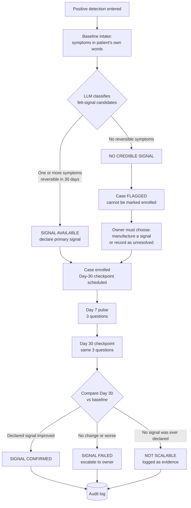
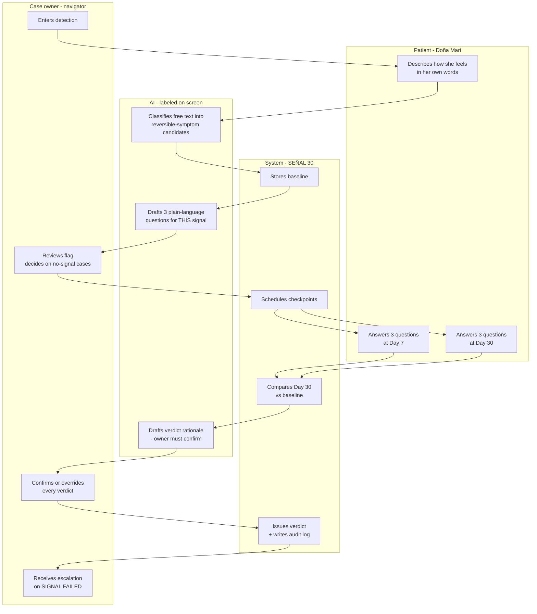
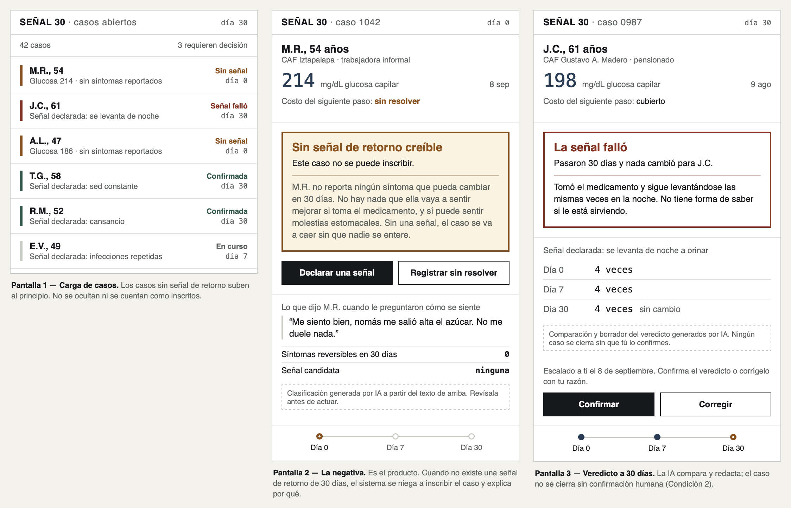

# PACKET — Week 5 Business Bending
**Fátima Fortes Ortega · Team 7 · Role: ADVERSARY · Blueprint Condition 5 (Shadow Clause)**

**Working name:** SEÑAL 30

---

## 1. The problem, in my words

Mexico measures constantly and detects almost nothing. Roughly 18,000 pharmacy-adjacent consultorios give ~10 million consultations a month; glucose gets measured hundreds of thousands of times, for 40 pesos, and then the reading evaporates — no record, no owner, no next step.

My team's Blueprint says every positive detection needs a named owner, a next action, a deadline and an escalation path. I agree, and my own research says that is **not sufficient**. Briones et al. (*Rev Méd Chile* 2022;150(8):985–993) found >70% non-adherence in a cohort where the drug was free and guaranteed by design. Those patients had an owner, a file, a scheduled refill and a funded channel. Seventy percent still walked.

**Why:** everything a diabetic patient can *feel* improve within 30 days — nocturia, thirst, fatigue, recurrent infection — is a symptom of significant hyperglycaemia. A patient found by asymptomatic screening has none of them by construction. Meanwhile the one thing metformin reliably produces in the first 30 days is gastrointestinal side effects. **The feedback loop is not open. It is inverted.** She felt nothing before the pill, feels worse after it, and is promised a benefit in a decade.

**The finding this build exists to operationalise:** *the strength of the return signal is inversely proportional to how early you detect.* The earlier a screening system finds her, the less she can feel, and the less reason she has to continue.

**So the problem is not "patients abandon treatment."** The problem is that no system in this chain ever checks whether a credible 30-day return signal exists *before* it enrols someone, and no system flags the cases where it doesn't. Custody that inspects the paperwork instead of the yield is a gate I would not accept on a production line.

## 2. The exact user

**Primary user — Miguel's role, the case owner.** A navigator / *responsable de caso* sitting between a consultorio and a treatment pathway. She manages 40–120 open cases, has ~90 seconds per case, and today has no way to distinguish a case that will self-sustain from one that will silently die at day 40. She is the one my screen is for.

**The person the system is about — Doña Mari, 54.** Informal worker, sells food outside the metro. Screened at a CAF. Reads slowly, uses WhatsApp, distrusts apps, gives up silently when confused. She is not my primary user this week (see scope cut) but every question the system asks must be answerable by her in her own words.

**Why the owner and not the patient:** Condition 4 of our Blueprint forbids family becoming the default unpaid owner, and my own research is why — Mexico's caregiver is a 40-year-old daughter working 17+ hours a day unpaid (*Enfermería Global* 2019, n=83). The accountable owner has to be someone with a role and a wage. Brazil's Agentes Comunitários de Saúde (400,000+ agents, 344.7M home visits in H1 2024) is the same woman, the same age — salaried. My tool is built for the salaried version of her.

## 3. Success definition

**Before the module closes, this works:**

A case owner can enter a positive detection, and the system will — within one screen — classify whether that case has a **credible 30-day return signal**, state which signal it is, and **refuse to mark the case as safely enrolled when no credible signal exists**. Thirty simulated days later, the system asks the patient three plain-language questions, compares the answer to the declared baseline, and issues one of three verdicts: **SIGNAL CONFIRMED**, **SIGNAL FAILED**, or **NO SIGNAL — NOT SCALABLE**.

**The single hardest test:** a case with no symptoms at baseline must come out of the system as **NO SIGNAL — NOT SCALABLE**, visibly, with the reason stated on screen. If the product can't tell the owner "I don't have a way to make this one stick," it has failed its own purpose.

## 4. The flow

### 4a. Feature flowchart

### 4b. Swimlane — who does what

**Note on Condition 2 (no automatic closure):** the AI never closes a case. It drafts; the owner confirms. Every verdict in the audit log carries the owner's ID.

## 5. Benchmark line

**The best existing solution on Earth for this is** Brazil's *Agentes Comunitários de Saúde* — 400,000+ salaried community agents, ~150–250 families each, whose formal duties include asking chronic patients about adherence and performing *busca ativa* on people who stopped attending (Lei 10.507/2002; Lei 11.350/2006; 344.7M home visits in H1 2024 per Sisab). It is the world's largest working post-detection follow-through loop.

**Mine differs or localizes by** being the instrument rather than the workforce: Mexico has no salaried ACS corps and won't have one by Sunday, so instead of assuming the owner exists, SEÑAL 30 audits whether a *credible return signal* exists for each case and refuses to enrol the ones where it doesn't — making the missing capacity visible and countable instead of silently absorbed by an unpaid daughter.

## 6. Long view — if this slice worked, what is it in 3 years?

In three years this is the layer that sits under every screening programme in Mexico and tells it, case by case, whether it has earned the right to detect. It stops being a checkpoint and becomes a market for return signals: whoever can supply a credible 30-day consequence — a state payer covering the ninety days, a structured self-monitoring protocol, an ACS-style salaried owner — plugs in here and gets paid on confirmed signals rather than on detections performed.

Its load-bearing wall is that it must always be able to say no. The moment it can be configured to pass every case, it becomes a compliance rubber stamp and it is worth less than nothing, because it will have laundered exactly the harm it was built to expose.

The commercial version is sold to whoever is accountable for outcomes rather than volume — a state programme, an insurer, an IMSS-Bienestar rollout — and its core asset is the one dataset nobody in Mexico currently has: which detections actually converted, segmented by whether the patient could feel anything.

## 7. Scope cut — what I am NOT building

| Not building | Why |
|---|---|
| Any detection or diagnostic model | Detection is not the constraint. PROSPERiA already works. |
| A symptom-checker chatbot | Forbidden Zone, explicitly. |
| The referral network / real clinic integrations | Miguel's handoff layer and Josep's orchestration cover adjacent ground; I audit, they route. |
| Payments, insurance or affordability routing | Diego's declaration (Condition 3). I display affordability status as a passed-in field only. |
| WhatsApp / SMS delivery | Real channel integration is a week of plumbing. Simulated in-app, labeled. |
| Real wearable or glucometer integration | Stack floor allows simulated structured signal, labeled. |
| Family/caregiver accounts | Condition 4 — optional, permission-based, patient-controlled. Out of scope this week rather than done badly. |
| Multi-org / multi-tenant | One owner account, one caseload. |
| Real patient data of any kind | Security floor. All seed data invented and labeled. |

## 8. Architecture + stack

| Layer | Choice | Why / free tier |
|---|---|---|
| Framework | Next.js (App Router), TypeScript | Vercel-native, one repo |
| Hosting | Vercel Hobby | Free, gives the live URL, 2 deploys minimum |
| Database | Supabase Postgres | Free tier, RLS built in |
| Auth | Supabase Auth — Sign in with Google | Security floor item 2 |
| Row security | RLS on every table with user data | Security floor item 3 |
| LLM | Google Gemini API, server-side route handler only | Key never reaches the client |
| Secrets | Vercel environment variables only; `.env.local` gitignored | Security floor item 1 |
| Validation | Zod on every form + server-side re-validation | Security floor item 4 |
| Time simulation | `simulated_day` column + "advance 30 days" dev control, labeled on screen | Lets the 30-day loop be demoed in 3 minutes |
| Styling | Tailwind | No design system to build |

**Data model (minimum):**

- `cases` — id, owner_id, patient_alias, detection_type, detection_value, detected_at, affordability_status, signal_status, created_at
- `baselines` — case_id, raw_text, classified_symptoms (jsonb), declared_signal, has_credible_signal (bool), ai_labeled (bool)
- `checkpoints` — case_id, day (7 or 30), responses (jsonb), verdict, ai_rationale, confirmed_by_owner_id, confirmed_at
- `audit_log` — case_id, event, actor, payload, created_at

RLS: `owner_id = auth.uid()` on `cases`; the rest joined through it.

**Screens (3):** `/cases` caseload list with signal status badges · `/cases/[id]` case detail with baseline, declared signal, checkpoint timeline and verdict · `/cases/new` intake.

## 9. Test plan

**Mechanical pass — run all, log results, fix at least one bug, redeploy:**

| # | Test | Expected |
|---|---|---|
| T1 | Case with clear reversible symptoms ("me levanto 4 veces en la noche") | SIGNAL AVAILABLE, primary signal = nocturia |
| T2 | Case with zero symptoms ("me siento bien, me salió alta el azúcar") | **NO SIGNAL — NOT SCALABLE**, flagged, cannot be marked enrolled |
| T3 | Ambiguous / non-reversible text ("me duele la rodilla") | Not accepted as a signal; flagged |
| T4 | Day-30 response shows improvement in declared signal | SIGNAL CONFIRMED, awaits owner confirmation |
| T5 | Day-30 response shows no change | SIGNAL FAILED, escalation raised to owner |
| T6 | Attempt to close a case without owner confirmation | Blocked (Condition 2) |
| T7 | Log in as owner B, request owner A's case by ID | 404/denied (RLS) |
| T8 | Submit 10,000-character free text; submit empty form | Rejected with message, nothing reaches DB or prompt |
| T9 | View page source / network tab | No API key present anywhere client-side |
| T10 | Any screen showing AI output | Visible "AI-generated — review before acting" label |

**Persona pass (Layer 1):** fresh chat, persona = *"Eres Doña Mari, 54 años, vendes comida afuera del metro. Usas WhatsApp pero desconfías de las apps, lees despacio, y cuando algo te confunde te sales sin decir nada."* Walk her through the baseline intake and the Day-30 questions by pasting each screenshot in order and asking her to attempt the task as herself, narrating hesitation. Log every confusion, fix the worst one, redeploy. **Expected weak point:** the free-text baseline box — she will not know what "síntomas" means in the abstract and needs examples in her own register.

## 10. Blueprint conditions — how this build honors them

| Condition | How |
|---|---|
| 1 — named owner, action, deadline, escalation | Every case carries owner_id; Day-30 deadline is the object the whole app is built on; SIGNAL FAILED raises escalation |
| 2 — no automatic closure | AI drafts, owner confirms; `confirmed_by_owner_id` required to write a verdict |
| 3 — affordability explicit | `affordability_status` displayed on the case, including the explicit value "financially unresolved" |
| 4 — family optional, never default owner | No family accounts this week; the owner field cannot be set to a family member |
| 5 — **SHADOW CLAUSE (mine)** | The entire product. A case with no credible 30-day return signal cannot be marked enrolled, and the system says so on screen |

---

### Mockup

**Pantalla 1 — Carga de casos.** Los casos sin señal de retorno suben al principio de la lista. No se ocultan ni se cuentan como inscritos.

**Pantalla 2 — La negativa.** Es el producto. Cuando no existe una señal de retorno de 30 días, el sistema se niega a inscribir el caso y explica por qué, en el lenguaje de la paciente.

**Pantalla 3 — Veredicto a 30 días.** La IA compara la línea base contra la respuesta del día 30 y redacta el veredicto; el caso no se cierra sin confirmación humana (Condición 2).

**Nota de diseño:** la interfaz está construida como una tarjeta de inspección de control de calidad, no como una app de salud. El producto es una compuerta que decide si un caso pasa o no pasa, y debe leerse como tal. El único elemento visualmente fuerte de cada pantalla es el veredicto.
